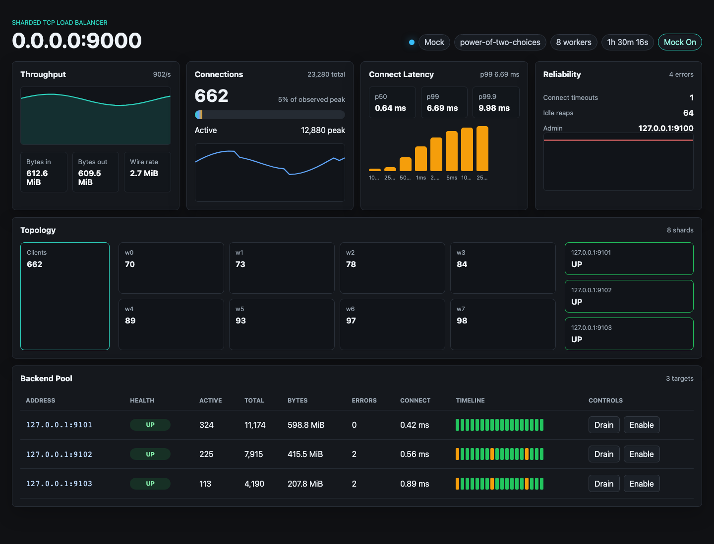

# TCP Load Balancer

A systems-focused TCP load balancer written in modern C++ for Linux. It proxies raw TCP streams with sharded nonblocking `epoll` workers, active backend health, Prometheus-style observability, and a live React control dashboard.



## Features

- Sharded worker model: one `epoll` loop and one `SO_REUSEPORT` listener per worker
- Round-robin, least-connections, and power-of-two-choices backend scheduling
- Active health checks, passive ejection, manual drain/enable controls
- Admin HTTP API with JSON stats, Prometheus metrics, Server-Sent Events, and backend drain/enable controls
- Real-time React dashboard with topology, health timeline, connect-latency histogram, and mock-data demo mode
- Connect and idle timeout reaping
- Structured leveled logging
- Per-connection buffering with read throttling for back-pressure
- Config-file driven listener, backend, and policy selection
- Unit-tested scheduler, config, runtime metrics, and admin route logic
- Docker build for Linux deployment
- Closed-loop smoke benchmark and open-loop latency benchmark harness

## Project Layout

```text
.
├── CMakeLists.txt
├── Dockerfile
├── config/backends.conf
├── web
├── include/lb
├── scripts
│   ├── benchmark.py
│   ├── open_loop_benchmark.py
│   └── run_local.sh
├── src
└── tests
```

## Configuration

Edit `config/backends.conf`:

```ini
listen=0.0.0.0:9000
admin=127.0.0.1:9100
policy=least-connections
workers=0
file_limit=25000
connect_timeout_ms=3000
idle_timeout_ms=60000
health_interval_ms=2000
health_timeout_ms=500
passive_failure_threshold=3

backend=127.0.0.1:9101
backend=127.0.0.1:9102
```

Supported policies:

- `round-robin`
- `least-connections`
- `power-of-two-choices`

## Build

The load balancer target uses Linux `epoll`. Build it on Linux or in Docker.

```bash
cmake -S . -B build -DCMAKE_BUILD_TYPE=Release
cmake --build build --parallel
ctest --test-dir build --output-on-failure
```

On macOS, CMake still builds and runs the scheduler tests, but it skips the Linux-only server binary.

Build the dashboard:

```bash
cd web
npm ci
npm run build
```

## Run

Start two local echo backends in one terminal:

```bash
python3 scripts/echo_backends.py --ports 9101 9102
```

Start the load balancer in another terminal on Linux:

```bash
./build/tcp-load-balancer --config config/backends.conf
```

Or run with Docker:

```bash
docker build -t tcp-load-balancer .
docker run --network host tcp-load-balancer
```

Open the dashboard at `http://127.0.0.1:9100`. If the load balancer is not running, the dashboard can still run in mock mode through Vite:

```bash
cd web
npm run dev
```

## Admin API

- `GET /stats` returns a JSON snapshot for the dashboard, including per-worker counters, per-backend state, and backend-connect latency buckets.
- `GET /metrics` returns Prometheus text metrics.
- `GET /events` streams stats snapshots with Server-Sent Events.
- `POST /backends/{id}/drain` marks a backend draining.
- `POST /backends/{id}/enable` returns a backend to active routing.

Example `/stats` shape:

```json
{
  "listener": "0.0.0.0:9000",
  "policy": "least-connections",
  "worker_count": 8,
  "active_connections": 412,
  "latency": {
    "kind": "backend_connect",
    "p50": 0.5,
    "p99": 5,
    "p999": 25,
    "buckets": [{ "le_us": 1000, "count": 120 }]
  },
  "workers": [{ "id": 0, "active_connections": 51 }],
  "backends": [{ "id": 0, "address": "127.0.0.1:9101", "state": "UP" }]
}
```

## Benchmark

With echo backends and the load balancer running:

```bash
python3 scripts/benchmark.py \
  --host 127.0.0.1 \
  --port 9000 \
  --connections 10000 \
  --requests-per-client 10 \
  --payload-bytes 128
```

The smoke benchmark reports total request throughput, median latency, and p99 latency for quick local checks. For high connection-count experiments, raise the OS file descriptor limit first:

```bash
ulimit -n 25000
```

Use the open-loop harness for any serious latency result:

```bash
python3 scripts/open_loop_benchmark.py \
  --host 127.0.0.1 \
  --port 9000 \
  --connections 10000 \
  --qps 50000 \
  --duration-seconds 60 \
  --payload-bytes 128 \
  --csv results.csv
```

See `BENCHMARKS.md` for methodology and the metadata required before publishing numbers. No README percentile or throughput claim should be added unless it comes from that open-loop harness on documented hardware.

## Design Notes

Each worker owns its own listener socket opened with `SO_REUSEPORT`, its own `epoll` instance, per-worker metrics counters, and all connections accepted by that worker. This keeps the data path local to one thread. Shared runtime state is limited to backend routing state, backend health, and atomics aggregated by the admin endpoint.

```text
clients
   |
   v
SO_REUSEPORT listener sockets
   |
   +--> worker 0: epoll + connection pairs
   +--> worker 1: epoll + connection pairs
   +--> worker N: epoll + connection pairs
   |
   v
backend pool + health state
```

Each client connection is paired with a backend connection. Incoming data is appended to the paired socket's output buffer and flushed whenever the socket is writable. If a paired output buffer grows beyond the high-water mark, reads from the source socket are temporarily disabled, applying back-pressure instead of allowing unbounded memory growth.

Least-connections scheduling tracks active proxied connections per backend and routes new clients to the backend with the lowest current count. Round-robin uses an atomic counter to rotate across backend indexes. Power-of-two-choices samples two routable backends and chooses the one with fewer active connections.

The admin server runs separately from the proxy workers and exposes the same runtime snapshot through JSON, Prometheus text, and SSE. The React dashboard consumes SSE when available, falls back to polling `/stats`, and can run in mock mode for demos and screenshots without a live load balancer.
